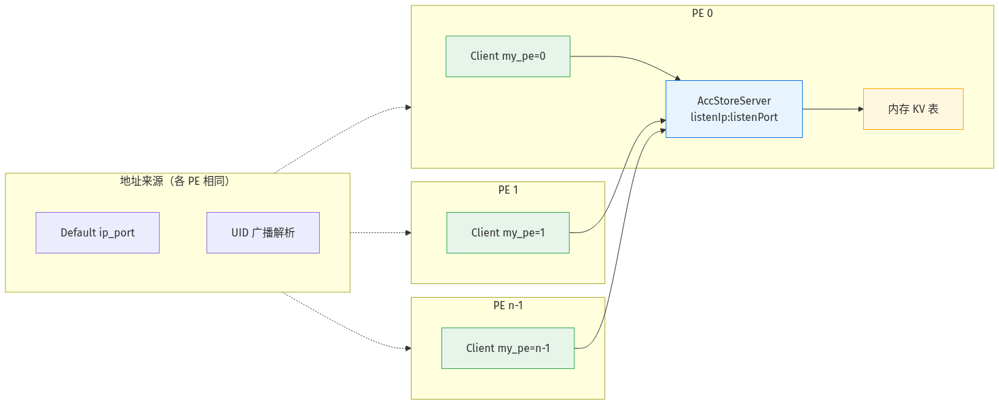
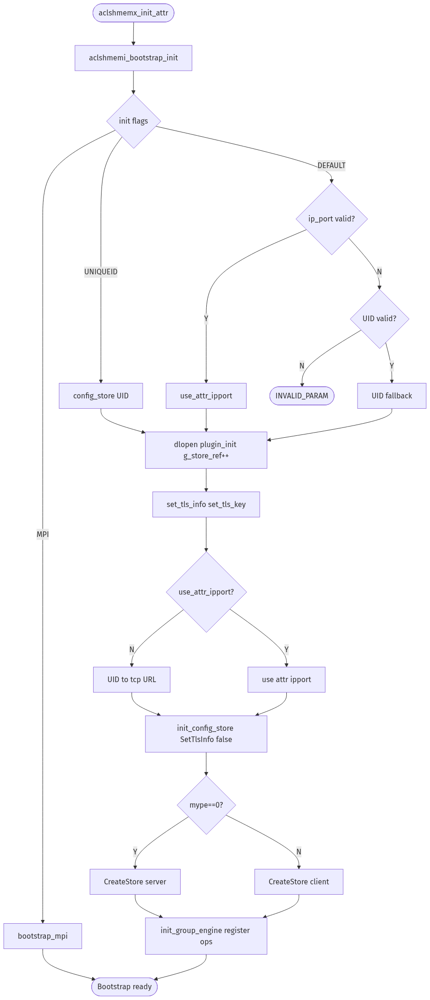
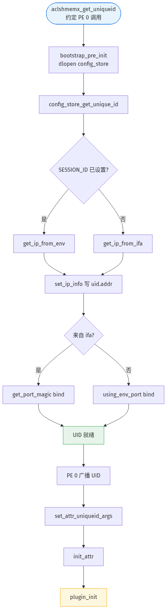
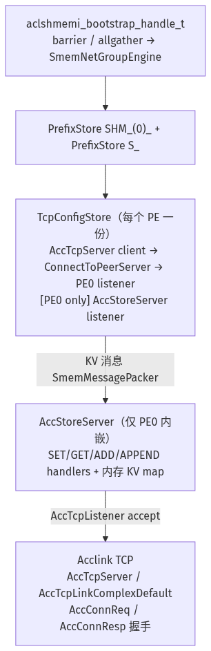
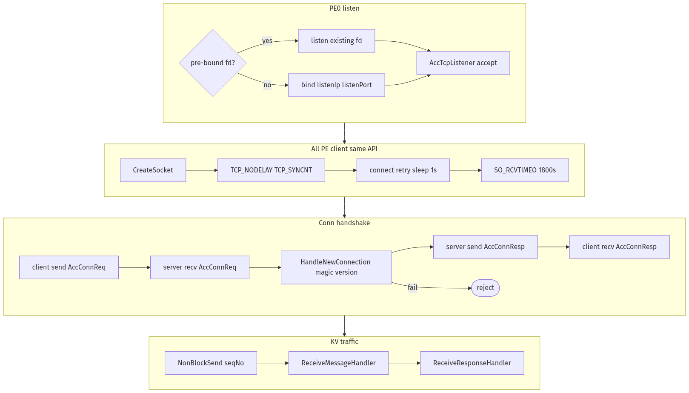
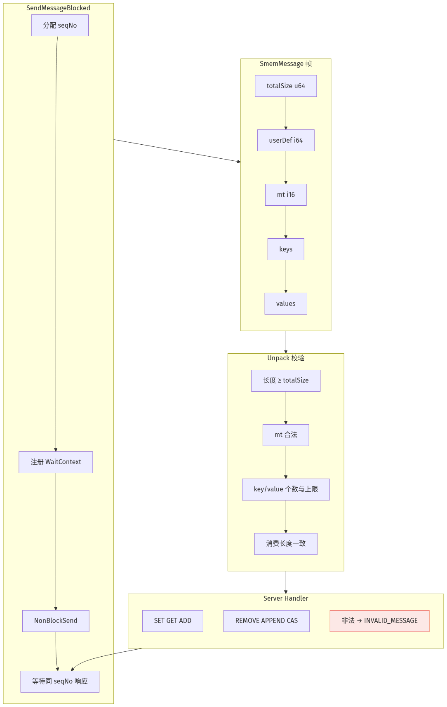
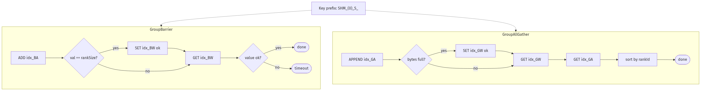

# Config Store Bootstrap 详解

> 本文专述 Default / UniqueID 模式下 **CPU 侧控制面** Bootstrap 的实现：TCP 建链、Config Store 键值协议、集合通信。不涉及 NPU / HYBM 对称堆。与 [init_finalize.md](init_finalize.md) 中 §3.2 Bootstrap 概要互补。

**阅读建议**：先读 [init_finalize.md §3.2](init_finalize.md#32-参数与-bootstrap) 了解模式选择与超时参数；本文从插件加载起展开 socket 与消息层细节。文中 **PE** 指参与 SHMEM 的单个进程（对应 `my_pe` / `n_pes`）；源码标识符如 `rankId`、`mype` 保持与代码一致。

---

## 一、概述

### 1.1 拓扑

Default / UID 模式加载 `aclshmem_bootstrap_config_store.so`，形成 **以 PE 0 为中心的星型拓扑**：

- **各 PE（含 PE 0）**：均创建 `TcpConfigStore` 客户端，经 **同一 API** `ConnectToPeerServer(serverIp_, serverPort_, …)` 连向 `handle->ipport` 解析出的 `serverIp:serverPort`（与 PE 0 listener 地址相同）。`AccConnReq.rankId` 填 `my_pe`；非 PE 0 的 connect 重试上限来自 `shm_init_timeout`，PE 0 client 为固定 60 次（见 §五、§10.1）。
- **仅 PE 0 额外启动 listener**：`AccStoreServer` 在 `listenIp:listenPort` 上 accept 入站 TCP，维护内存 KV 表。PE 0 的 client 目标地址与其 listener **相同**（通常为本机 IP + 端口），并非另一套 connect 方式。

Bootstrap 完成后，`g_boot_handle.barrier` / `allgather` 由 `SmemNetGroupEngine` 在 KV 表上实现，供 init 阶段 `exchange_slice`、`aclshmem_malloc` 同序等控制面同步使用。与后续 HYBM 设备堆建链无关。



*图 1：PE 0 监听 KV 服务；**各 PE** 的 client 均 connect 至同一 `serverIp:serverPort`（Default `ip_port` 或 UID 广播）。*

---

## 二、入口与调用链

### 2.1 总调用链

```
aclshmemx_init_attr()
  └─ aclshmemi_bootstrap_init()                    [shmemi_bootstrap.cpp]
       ├─ 按 flags 选择插件、解析 ip_port / UID
       ├─ dlopen("aclshmem_bootstrap_config_store.so")
       └─ aclshmemi_bootstrap_plugin_init()        [shmemi_bootstrap_config_store.cpp]
            ├─ [UID 路径] 从 comm_args 构造 handle->ipport / sockFd / 超时
            ├─ config_store_set_tls_info / set_tls_key（L316-322）
            ├─ init_config_store() → TcpConfigStore::Startup
            ├─ init_group_engine() → SmemNetGroupEngine
            └─ 注册 barrier / allgather / finalize
```

`aclshmemx_get_uniqueid` 走 **pre-init** 路径：`aclshmemi_bootstrap_pre_init` → `config_store_get_unique_id`（L45），在正式 init 前由 **PE 0** 生成 UID。

### 2.2 `aclshmemi_bootstrap_init` 分支

| 模式 | 插件 | `comm_args` | IP/端口来源 |
|------|------|-------------|-------------|
| `ACLSHMEMX_INIT_WITH_UNIQUEID` | config_store | UID 结构体指针 | plugin 从 UID 提取 |
| `ACLSHMEMX_INIT_WITH_DEFAULT` | config_store | UID 或 nullptr | 合法 `attr->ip_port` 优先，否则 UID fallback |
| `ACLSHMEMX_INIT_WITH_MPI` | bootstrap_mpi | `MPI_Comm*` | **不走 Config Store** |

Default 分支（`shmemi_bootstrap.cpp` L280–304）：

1. `is_valid_ip_port_url(attr->ip_port)` 为真 → `use_attr_ipport=true`，拷贝 `ip_port`、`sockFd`、`shm_init_timeout`、`control_operation_timeout`。
2. 否则 `is_uid_args_valid(comm_args)` → UID fallback（`use_attr_ipport=false`）。
3. 否则返回 `ACLSHMEM_INVALID_PARAM`。

`is_valid_ip_port_url` 要求 URL 为 `tcp://host:port` 或 `tcp6://[host]:port`，端口 **> 1024**，host 为合法 IP 或 hostname。



*图 2：`aclshmemi_bootstrap_init` 模式分支 → `plugin_init`（含 TLS 配置）→ `init_config_store` / `init_group_engine`。MPI 模式不进入 config_store 路径。*

---

## 三、IP 与端口解析

### 3.1 路径 A：`use_attr_ipport == true`（Default + 合法 ip_port）

| 字段 | 来源 | 用途 |
|------|------|------|
| `handle->ipport` | `attr->ip_port` | 解析为监听/连接地址 |
| `handle->sockFd` | `attr->option_attr.sockFd` | PE 0 预绑定 listen fd（-1 表示由库 bind） |
| `handle->timeOut` | `attr->option_attr.shm_init_timeout` | 非 PE 0 建链：`ConnectToPeerServer` 最大重试次数（见 §10.1） |
| `handle->timeControlOut` | `attr->option_attr.control_operation_timeout` | barrier/allgather 超时（秒） |

多 instance：`instance_id != 0` 且 `ip_port` 非空、模板端口为 **0** 时，在 `aclshmemi_instance_ctx_create`（`shmem_init.cpp`）中调用 `aclshmemi_instance_port_selection`，按 `SHMEM_INSTANCE_PORT_RANGE` 替换端口；纯 UID（`ip_port` 为空且 `comm_args` 有效）跳过该步骤。

### 3.2 路径 B：UID / Default→UID（`use_attr_ipport == false`）

`plugin_init`（L280–314）从 `comm_args` 读取 `aclshmemi_bootstrap_uid_state_t`：

- IPv4 → `tcp://{ip}:{port}`
- IPv6 → `tcp6://[{ip}]:{port}`
- `handle->sockFd = uid_args->inner_sockFd`
- `handle->timeOut = handle->timeControlOut = DEFAULT_TIMEOUT`（120）。`timeControlOut` 为控制面超时（秒）；`timeOut` 在 Config Store 中同样按 **connect 重试次数** 使用（见 §10.1）

写入 `handle->ipport` 后，**所有 PE** 的 `serverIp_`/`serverPort_` 均指向 PE 0 公布的同一地址。

### 3.3 PE 0 生成 UID（`config_store_get_unique_id`）

| 环境变量 | 行为 |
|----------|------|
| `SHMEM_UID_SESSION_ID` | 解析固定 `host:port` → `aclshmemi_using_env_port` 绑定该端口，得到 `inner_sockFd` |
| （未设置） | `SHMEM_UID_SOCK_IFNAME` 指定网卡（未设置则自动选网卡）→ `aclshmemi_get_ip_from_ifa` 取 IP → `aclshmemi_get_port_magic` 在 [1024,65536) 随机选可用端口并 bind，得到 `inner_sockFd` |

`aclshmemi_set_ip_info`（`store_net_utils.h`）填充 `aclshmemx_uniqueid_t` 内 `addr` 与 `inner_sockFd`。PE 0 调用 `aclshmemx_get_uniqueid` 后须将 **完整 UID 字节广播** 给各 PE，各 PE 再 `aclshmemx_set_attr_uniqueid_args`。



*图 6：`aclshmemx_get_uniqueid` pre-init 路径、IP/端口绑定与后续 init 衔接。库不负责 UID 广播。*

### 3.4 URL 解析（建 Store 前）

`init_config_store` 调用 `UrlExtraction::ExtractIpPortFromUrl`（`store_net_common.cpp`），从 `handle->ipport` 得到：

- `option.ip`：监听/连接 IP（hostname 会解析，**不** fallback 到 `0.0.0.0`）
- `option.port`：端口号（须 > 1024）

---

## 四、分层架构



*图 7：自 `aclshmemi_bootstrap_handle_t` 至 Acclink TCP 的分层；KV 集合通信经 `PrefixStore` 前缀键实现，PE 0 额外嵌入 `AccStoreServer` listener。*

| 组件 | 文件 | 职责 |
|------|------|------|
| `StoreFactory` | `store_factory.cpp` | `CreateStore` / `DestroyStore` / TLS 全局配置 |
| `TcpConfigStore` | `store_tcp_config.cpp` | 各 PE 的 Store 客户端；PE 0 额外嵌入 Server |
| `AccStoreServer` | `store_tcp_config_server.cpp` | PE 0 KV 服务与消息分发 |
| `AccTcpServer` | `acc_tcp_server_default.cpp` | 传输层（命名易混：client/server 均用此类） |
| `AccTcpListener` | `acc_tcp_listener.cpp` | PE 0 accept 与连接级握手 |
| `SmemNetGroupEngine` | `store_net_group_engine.cpp` | 基于 KV 的 barrier / allgather |

图 1（拓扑）与本图各组件对应关系见上表；PE 0 同时持有 listener 与 client 两条 TCP 路径，client 与其余 PE 使用相同 `ConnectToPeerServer` 入口。

---

## 五、建 Store：`init_config_store`

```cpp
// shmemi_bootstrap_config_store.cpp:230-235
if (handle->mype == 0)
    CreateStore(ip, port, isServer=true, rankId=0, connMaxRetry=-1, sockFd);
else
    CreateStore(ip, port, isServer=false, rankId=mype, connMaxRetry=timeOut);
```

| 参数 | PE 0（`my_pe==0`） | 非 PE 0 |
|------|-------------------|---------|
| `isServer` | `true`（嵌入 `AccStoreServer`） | `false` |
| `ConnectToPeerServer` | **有**（与其余 PE 相同 API/目标地址） | **有** |
| `connMaxRetry` | `-1` → 内部 **60** | `handle->timeOut` |
| `connReq.rankId` | `0` | `mype` |
| `sockFd` | 预绑定 listen fd 或 -1 | 未使用（传 -1） |

---

## 六、Socket 绑定与连接（核心）

### 6.1 PE 0：监听 socket 绑定什么

`AccStoreServer::AccServerStart`（`store_tcp_config_server.cpp:33-41`）设置：

```text
listenIp   = 从 URL 解析的 option.ip
listenPort = 从 URL 解析的 option.port
enableListener = true
sockFd     = handle->sockFd（预绑定 fd，或 -1）
```

`AccTcpListener::Start`（`acc_tcp_listener.cpp:110`）：

| 条件 | 行为 |
|------|------|
| `listenFd_ > 0`（预绑定） | **跳过 bind**，在已有 fd 上 `listen(backlog=200)` |
| `listenFd_ <= 0` | `socket` → `SO_REUSEADDR` → `bind(listenIp, listenPort)` → `listen(200)` |

预绑定 fd 来源：

- Default：`attr->option_attr.sockFd`（用户已 bind 的监听 socket）
- UID：PE 0 `get_uniqueid` 时 `inner_sockFd`（`aclshmemi_get_port_magic` 或 `aclshmemi_using_env_port` 产生）

监听地址为 URL 中的 **具体 IP/hostname**，不会自动绑定 `INADDR_ANY`。

### 6.2 各 PE 客户端 connect（统一路径）

`TcpConfigStore::Startup`（`store_tcp_config.cpp:152-203`）在 **所有 PE** 上执行相同 client 建链（PE 0 在 `AccStoreServer::Startup` 之后同样调用）：

```text
ConnectToPeerServer(serverIp_, serverPort_, connReq, retryMaxTimes, accClientLink_)
connReq.rankId = rankId_   // PE 0 为 0，其余为 mype
```

- `serverIp_` / `serverPort_`：各 PE 相同，均来自 `handle->ipport` 解析，与 PE 0 `listenIp:listenPort` 一致。
- PE 0 client 连向 **同一** `serverIp:serverPort`（通常即本机 listener 地址）；非 PE 0 连向 UID 广播或 Default 中的 PE 0 地址——**connect 实现与参数结构无差别**，仅 `rankId` 与 `retryMaxTimes` 不同。

`ConnectToPeerServer`（`acc_tcp_server_default.cpp:532`）：

1. `CreateSocket(peerIp)` → IPv4/IPv6/hostname 解析。
2. `TCP_NODELAY`、`TCP_SYNCNT=1`（快速 connect 探测）。
3. 循环 `connect()`，失败则 **sleep(1)**，最多 `maxRetryTimes` 次。
4. 成功后 `SO_RCVTIMEO = ACC_LINK_RECV_TIMEOUT`（1800s），进入 `Handshake`。

### 6.3 连接建立后的两条 socket 路径

**路径 1 — 业务 KV（所有 PE）**

```text
TcpConfigStore::SendMessageBlocked
  → accClientLink_->NonBlockSend(seqNo, SmemMessage body)
  → PE 0 AccStoreServer::ReceiveMessageHandler
  → SET/GET/ADD/... Handler
  → 响应经 ReceiveResponseHandler 唤醒客户端
```

**路径 2 — 新 PE 接入时的连接级握手（listener accept）**

```text
AccTcpListener accept 新 TCP fd
  → ProcessNewConnection：recv(AccConnReq)
  → （可选）TLS accept
  → HandleNewConnection：校验 magic/version → Initialize link → newLinkHandle_（AccStoreServer 为 LinkConnectedHandler，仅日志）
  → 将 link 加入 worker epoll
  → send(AccConnResp{result=0})
```

注意：KV 业务走 **已建立的 accClientLink_**；accept 线程上的 `AccConnReq` 用于 Acclink 内部对新入站连接的登记，与 Config Store 消息帧无关。



*图 3：PE 0 监听；**各 PE** 经同一 connect API 建链；client/server 分列展示连接级握手；KV 业务独立于此。*

---

## 七、Acclink TCP 握手

连接级握手在 `AccConnReq` / `AccConnResp` 上完成；Config Store 建链时在请求中携带 `rankId`（即 `my_pe`，`store_tcp_config.cpp:201-202`）。

### 7.1 客户端（主动 connect 侧，`Handshake`）

1. `send(AccConnReq)` 整结构。
2. （可选）TLS：`CreateSSLLink`。
3. `BlockRecv(AccConnResp)`，要求 `result == ACC_OK`。

### 7.2 服务端（accept 侧，`ProcessNewConnection` → `HandleNewConnection`）

1. `AccTcpListener::ProcessNewConnection`（`acc_tcp_listener.cpp:300`）`recv(AccConnReq)`，长度须等于 `sizeof(AccConnReq)`，否则关闭 fd。
2. （可选）TLS：`AccTcpSslHelper::NewSslLink`。
3. 调用 `HandleNewConnection`（`acc_tcp_server_default.cpp:361`）：
   - **magic / version 校验**（L364-372）：不匹配则拒绝；
   - `Initialize` link，调用 `newLinkHandle_`（Config Store 上注册为 `AccStoreServer::LinkConnectedHandler`，L170-174，仅打日志）；
   - `EnableNoBlocking`，`worker->AddLink` 加入 epoll。
4. `ProcessNewConnection` 发送 `AccConnResp{result=0}`（L345-347）。

---

## 八、Config Store 消息协议

### 8.1 帧格式（`SmemMessagePacker`）

**线上布局**（`store_message_packer.cpp:18-47`）：

```text
[totalSize: u64]
[userDef:   i64]     ← GET 阻塞等待超时(ms)；其他操作常为 0
[mt:        i16]     ← MessageType
[keyCount:  u64]
  重复 keyCount 次: [keyLen: u64][key bytes]
[valueCount: u64]
  重复 valueCount 次: [valueLen: u64][value bytes]
```

**Unpack 校验**（L69-119）：

- buffer 长度须 `Full()`（≥ header 且 ≥ totalSize）。
- `mt` 须满足 `SET ≤ mt ≤ INVALID_MSG`（`store_message_packer.cpp:83`；合法业务类型为 `SET`…`CAS`）。
- `keyCount ≤ 10`，每 key `≤ 2048` 字节（server）；client 侧 key 上限 1024。
- `valueCount ≤ 10`，每 value `≤ 64MB`。
- 解析后 `totalSize == 实际消费长度`，否则失败。

### 8.2 消息类型与语义

| 类型 | Client 请求 | Server 校验与行为 |
|------|-------------|-------------------|
| **SET** | 1 key + 1 value | 写入/覆盖 KV；若 key 上有 GET 等待者则唤醒 |
| **GET** | 1 key，无 value；`userDef`=超时 ms | 有值立即返回；无值则阻塞至 SET 或超时（timer 线程） |
| **ADD** | 1 key + 增量（十进制字符串） | 原子加；key 不存在则创建 |
| **REMOVE** | 1 key | 删除；不存在返回 `NOT_EXIST` |
| **APPEND** | 1 key + 字节块 | 追加；返回新总长度 |
| **CAS** | 1 key + expect + new | 比较交换 |

非法类型、key/value 个数、长度 → `INVALID_MESSAGE`（-400）或 `INVALID_KEY`（-401）。

### 8.3 客户端发送与响应匹配

`TcpConfigStore::SendMessageBlocked`（L484-512）：

1. 分配单调递增 `seqNo`。
2. 注册 `ClientWaitContext` 到 `msgClientContext_[seqNo]`。
3. `accClientLink_->NonBlockSend(0, seqNo, dataBuf, nullptr)`。
4. 阻塞等待 `ReceiveResponseHandler` 按 **相同 seqNo** 唤醒，返回 `AccTcpRequestContext`。
5. 调用方（如 `Set`/`Get`）对 response body 做 `Unpack`，读取 `Header().result` 与 payload。

链路断开时 `LinkBrokenHandler` 唤醒所有 pending 请求为失败。



*图 4：`SmemMessagePacker` 线上布局、Unpack 边界校验，以及客户端按 `seqNo` 匹配响应的流程。*

---

## 九、SmemNetGroupEngine：barrier 与 allgather

### 9.1 键名前缀

```text
init_group_engine:
  PrefixStore(store, "SHM_(0)_")        // DEFAULT_ID = 0

SmemNetGroupEngine::Create:
  PrefixStore(store, "S_")               // 静态组（bootstrap：option.dynamic=false）

// option.dynamic=true 时使用 "D_" 前缀（动态组 Join/Leave，非 Bootstrap 路径）
```

完整 key 示例：`SHM_(0)_S_{groupVersion}_{sn}_BA`。

### 9.2 GroupBarrier（`store_net_group_engine.cpp:80`）

对序号 `idx = "{groupVersion}_{barrierGroupSn_}"`：

1. `ADD idx_BA` → 返回值 `val`（当前到达 PE 数）。
2. 若 `val == rankSize`（`n_pes`）：最后到达的 PE `SET idx_BW = "ok"`。
3. 全体 `GET idx_BW`，超时 `option_.timeoutMs`（来自 `control_operation_timeout * 1000`）。
4. 读到的值须等于 `"ok"`。
5. `val == 1` 且 `barrierGroupSn_ > REMOVE_INTERVAL`（2）时，首个到达 PE 周期性 `REMOVE` 两轮前的 `{idx}_BA` / `{idx}_BW` key。

`npes == 1` 时 bootstrap barrier 直接返回（`config_store_bootstrap_barrier` L191-194）。

### 9.3 GroupAllGather（L207 起）

1. 构造 `{my_pe: u32}{payload}`（线上字段名 `rankId`），对 `idx_GA` 做 **APPEND**，返回累计字节数 `val`。
2. 当 `val == sendSize * rankSize`，最后到达 PE `SET idx_GW = "ok"`。
3. 全体 `GET idx_GW` 等待完成，再 `GET idx_GA` 取全量 blob。
4. 按 embedded `rankId`（PE 编号）排序，拷贝到 `recvBuf`（每 PE 一段 `sendSize`）。
5. `val == input.size()` 且 `allGatherGroupSn_ > REMOVE_INTERVAL`（2）时，**首个**完成 APPEND 的 PE 清理两轮前的 `{idx}_GA` / `{idx}_GW` key（`store_net_group_engine.cpp:231`）。

Bootstrap 包装：`config_store_bootstrap_allgather` 要求 `recv` 缓冲区 ≥ `len * npes`。



*图 5：键前缀 `SHM_(0)_S_`；`SmemNetGroupEngine` 在 KV 上实现的 barrier（ADD/SET/GET）与 allgather（APPEND/SET/GET/排序）协议。*

---

## 十、超时、TLS 与多 instance

### 10.1 超时汇总

**`shm_init_timeout` 命名与实现**

对外字段名及 `shmem_host_def.h` 中 `DEFAULT_TIMEOUT` 注释均表述为 **init 超时（秒）**。在 Config Store 建链路径上，该值 **不做秒→次数换算**，而是原样传递：

```text
option_attr.shm_init_timeout
  → g_boot_handle.timeOut                    [shmemi_bootstrap.cpp:289]
  → CreateStore(..., connMaxRetry)           [shmemi_bootstrap_config_store.cpp:234]
  → TcpConfigStore::Startup(reconnectRetryTimes)
  → ConnectToPeerServer(..., maxRetryTimes)  [acc_tcp_server_default.cpp:556]
```

`ConnectToPeerServer` 在 `timesRetried < maxRetryTimes` 循环内调用 `connect()`，失败则 `sleep(1)` 后重试。因此数值 **N 表示最多 N 次 connect 尝试**，最坏情况下约 **N 秒** 建链窗口（默认 120 与「120 秒超时」在数值上相近），但实现上是 **重试次数上限**，不是按 wall-clock 计时的超时器。

| 配置 | 典型值 | 作用 | 实现语义 |
|------|--------|------|----------|
| `shm_init_timeout` | 默认 120（API 按秒命名） | 非 PE 0 连 PE 0 listener | **重试次数** → `maxRetryTimes` |
| PE 0 client 建链 | 固定 60 次 | 与同 API，连本机 `serverIp:serverPort` | `connMaxRetry=-1` → `CONNECT_RETRY_MAX_TIMES` |
| `control_operation_timeout` | 用户 attr（秒） | barrier/allgather | `SmemGroupOption.timeoutMs = ×1000` |
| UID 路径 `timeOut` | `DEFAULT_TIMEOUT`（120） | 非 PE 0 建链 | **重试次数**（与 `timeControlOut` 秒数语义不同） |
| `ACC_LINK_RECV_TIMEOUT` | 1800s | 握手完成后 socket `SO_RCVTIMEO` | 秒 |
| GET 阻塞 | 请求内 `userDef` ms | Server 侧等待 key 出现的上限 | 毫秒 |

### 10.2 TLS

- init 前：`aclshmemx_set_conf_store_tls` / `aclshmemx_set_config_store_tls_key` 写入 `g_boot_handle`（`shmem_init.cpp:681` / `696`）。
- `plugin_init` 在调用 `init_config_store` **之前**，根据 handle 调用 `config_store_set_tls_info`、`config_store_bootstrap_set_tls_key`（`shmemi_bootstrap_config_store.cpp:316-322`），写入 `StoreFactory`。
- `init_config_store` 入口随即 `SetTlsInfo(false, nullptr, 0)`（L225），将 `StoreFactory::enableTls` 置为 false；`CreateStore` → `InitTlsOption`（`store_factory.cpp:210-217`）按此时 `enableTls` 与已缓存的 TLS 字段初始化 `tlsOption_`。
- 启用 TLS 时 listener 与 client 在 `AccStoreServer::AccServerStart` / `TcpConfigStore::AccClientStart` 中按 `tlsOption.enableTls` 加载 OpenSSL 动态库并 `Start`（`AccTcpSslHelper`）。

### 10.3 多 instance：`g_store_ref`

- 每次 `plugin_init`：`g_store_ref++`（L263）。
- `config_store_bootstrap_finalize`：`g_store_ref--`；仅当减至 0 时 `StoreFactory::DestroyStore()`（TLS 清理线程）。
- 各 instance 独立 `ConfigStoreState` 与 `TcpConfigStore`；全局 Destroy 不负责停止其他 instance 的连接。

---

## 十一、Finalize

### 11.1 调用位置与 control barrier

各 PE 在 `aclshmemi_finalize_impl` 中，于对称堆 / entity / **default stream** 释放完成之后、`aclshmemi_bootstrap_finalize()` **之前**，调用 **`aclshmemi_control_barrier_all()`**，在 Config Store 上做一次 **`GroupBarrier`**（与 init 收尾、malloc 后 barrier 相同路径：`g_boot_handle.barrier` → `config_store_bootstrap_barrier` → KV `ADD/GET`）。

**语义**：全体 `n_pes` 均须 **已进入 finalize 并到达该 barrier**，之后才允许任一 PE 执行 Bootstrap teardown。PE 0 **不会**在尚有 PE 未到达 barrier 时关闭 listener。

```text
aclshmemi_finalize_impl()
  ├─ team / signal / memory_manager / heap / entity / stream …
  ├─ aclshmemi_control_barrier_all()     ← Finalize 控制面同步（Config Store GroupBarrier）
  └─ aclshmemi_bootstrap_finalize()
       └─ config_store_bootstrap_finalize()
            ├─ g_store_ref--
            ├─ [g_store_ref==0] StoreFactory::DestroyStore()   // 仅 TLS 清理线程
            ├─ group_engine_ = nullptr
            ├─ store_ = nullptr  → ~TcpConfigStore → Shutdown()
            └─ delete ConfigStoreState
```

| 阶段 | 跨 PE 同步 | 说明 |
|------|------------|------|
| heap / stream 释放 | 无 | 各 PE 本地顺序执行 |
| **`aclshmemi_control_barrier_all`** | **有** | Config Store KV barrier；超时见 `control_operation_timeout` |
| `aclshmemi_bootstrap_finalize` 之后 | 无 | 各 PE 本地拆 Bootstrap 连接 |

`npes == 1` 时 bootstrap barrier 直接跳过（与 init 阶段相同）。Finalize 流程图见 [init_finalize.md §4.2](init_finalize.md#42-执行顺序) 与 `images/initialization/shmem_finalize_flow.png`。

### 11.2 本 PE 资源释放（`TcpConfigStore::Shutdown`）

Barrier **通过之后**，各 PE 进入 `config_store_bootstrap_finalize` → `~TcpConfigStore` → `Shutdown()`：

**所有 PE**（`store_tcp_config.cpp:213-230`）：

1. `accClientLink_ = nullptr`
2. `accClient_->Stop()` — 断开本 PE 到 PE 0 的 client TCP

**仅 PE 0 额外**（`accServer_ != nullptr`），在 client 停止之后 **立即**（`store_tcp_config.cpp:226-228`）：

3. `AccStoreServer::Shutdown` → `accTcpServer_->Stop()`（`acc_tcp_server_default.cpp:109`）：
   - **先** `StopAndCleanListener`（L117）→ join accept 线程 → `SafeCloseFd(listenFd_)`
   - **再** `StopAndCleanWorkers`（L119）— teardown 仍连着的入站 TCP
   - **再** `StopAndCleanDelayCleanup`（L121）
4. join GET 超时 `timerThread_`（`store_tcp_config_server.cpp:130-136`）
5. `sockFd_ = -1`

PE 0 在本地 `Shutdown` 内的顺序（与 `AccTcpServerDefault::Stop` 一致）：

```text
① 关 PE 0 自己的 client（accClient_->Stop）
② AccStoreServer::Shutdown → 关 listener → 关 server worker → delay cleanup
③ join timerThread_
```

因 barrier 已保证 **全体 PE 均到达 finalize 拆 Bootstrap 前同步点**，不会出现「其他 PE 尚未进入 finalize、PE 0 已关 listener」；若某 PE **从未进入 finalize**，其余 PE 会在 §11.1 的 barrier 处阻塞直至超时，**不会**执行 `aclshmemi_bootstrap_finalize`。

### 11.3 能否保证「所有 PE 都释放」

| 维度 | 行为 |
|------|------|
| **已进入 finalize 的 PE** | barrier 通过后各自 `Shutdown`；PE 0 关闭 listener，各 PE 关闭 client |
| **未进入 finalize 的 PE** | 已在 finalize 中的 PE 在 `GroupBarrier` 等待；超时后 finalize **失败**，Bootstrap **不拆**（barrier 失败则不应到达 `aclshmemi_bootstrap_finalize`） |
| **对称性要求** | 仍须 **每个 PE 均调用** `aclshmem_finalize`；barrier 只同步「已进入 finalize 的集合」，不替代应用层启动 finalize |
| **多 instance** | 每 instance 独立 `ConfigStoreState`；`g_store_ref` 归零时 `DestroyStore()` 仅 TLS 全局清理 |

**结论**：Finalize 阶段在拆 Bootstrap **前**有一次 control barrier；PE 0 监听端口在 **barrier 通过且本 PE 执行 `Shutdown`** 时释放。

### 11.4 Barrier 未覆盖的场景

Finalize barrier **只**保证：已进入 finalize 的全体 PE 在拆 Bootstrap 前对齐（§11.1）。以下仍须应用保证：

**（1）device 在途工作**

`aclshmemi_control_barrier_all` 是 **CPU 控制面** KV 同步，**不等** device kernel / stream。而 heap、entity 等在 barrier **之前** 已本地释放，若 device 仍有未完成 RMA，会在 finalize 过程中踩已释放资源。因此须在调用 `aclshmem_finalize` **前** 完成 stream / kernel 同步（与 [init_finalize.md §1.5](init_finalize.md#15-终止约束) 一致）。

**（2）对称调用与 barrier 轮次**

`aclshmem_malloc` / `aclshmem_free` 每次返回前都会经 `aclshmemi_control_barrier_all` 走一轮 Config Store `GroupBarrier`（§9.2，`barrierGroupSn_` 递增）；finalize 在 `aclshmemi_bootstrap_finalize` **前**再调用一次同路径 barrier。各 PE 须 **同序同大小**参与 malloc/free，并 **对称**调用 `aclshmem_finalize`。

若运行期 malloc/free 未对称参与，各 PE 会停在 **不同轮次** 的 control barrier 上（例如部分 PE 等在 malloc 触发的 `{sn}_BA`，其余 PE 已推进到更后的序号）。此时若有 PE 先进入 finalize，会在 **finalize 那一轮** barrier 上等待全员到齐；尚未进入 finalize 或仍卡在更早 malloc barrier 的 PE **不会加入同一轮**，表现为：

- 已进入 finalize 的 PE：**堵在 `aclshmemi_bootstrap_finalize` 前的 control barrier**；
- 仍在 malloc/free 路径上的 PE：**堵在该次分配/释放对应的 control barrier**；

两边 **barrier 轮次错配**，互相等不到，finalize 侧直至 `control_operation_timeout` 失败，**不会**执行 `aclshmemi_bootstrap_finalize`。对称 finalize 本身也是同一机制：任一 PE 未进入 finalize，其余 PE 同样无法在同一轮 barrier 到齐。

| 场景 | 后果 |
|------|------|
| malloc/free 未对称，部分 PE 先 finalize | finalize 侧与 malloc 侧 **barrier 轮次错配** → 分别堵在不同轮 barrier → finalize 超时，**不**执行 `bootstrap_finalize` |
| 某 PE **未**调用 `aclshmem_finalize` | 已进入 finalize 的 PE 堵在 finalize 前 barrier → 超时 → 同上 |
| 全员 malloc/free 对齐且对称 finalize | finalize barrier 到齐 → 各 PE 执行 `aclshmemi_bootstrap_finalize` |
| device 已 sync | 避免 heap 释放后仍有在途 RMA（§11.4（1）） |

**建议**：device 同步完成 → 各 PE **对称**调用 `aclshmem_finalize` → 库内 barrier 对齐后再拆 Config Store。

---

## 十二、PE 0 与非 PE 0 端到端时序

### 共性（所有 PE）

1. 解析 **相同** `ipport`（Default attr、UID 广播或 fallback）。
2. `TcpConfigStore::Startup` → `ConnectToPeerServer(serverIp_, serverPort_, rankId=mype, …)` → 握手 → `accClientLink_`。
3. `init_group_engine` → 参与 barrier/allgather。

### 仅 PE 0 额外步骤

1. `CreateStore(isServer=true)` → `AccStoreServer::Startup`：`bind/listen` 于 `listenIp:listenPort`（可在 client connect **之前** 完成，使 listener 就绪）。
2. client 连向与 listener **相同的** `serverIp:serverPort`；`connMaxRetry` 固定 60，与 `shm_init_timeout` 无关。
3. 可选预绑定 `sockFd` 供 listener 复用。

### 非 PE 0

1. `CreateStore(isServer=false)`，无 listener。
2. `ConnectToPeerServer` 目标地址与 PE 0 client **相同**；`connMaxRetry = timeOut`（来自 `shm_init_timeout` 或 UID 的 `DEFAULT_TIMEOUT`）。

### Finalize（与 §十一对应）

1. 本地资源释放（team / heap / entity / stream）。
2. **`aclshmemi_control_barrier_all`** — 全体 PE 在 Config Store 上对齐。
3. **`aclshmemi_bootstrap_finalize`** → 各 PE `TcpConfigStore::Shutdown`；PE 0 额外关 listener。

| PE | barrier 通过后释放 |
|----|-------------------|
| 所有 PE | client `accClientLink_`、`accClient_->Stop()` |
| PE 0 额外 | `listenFd_` 关闭、accept/timer 线程、server worker |

---

## 十三、源码索引

| 主题 | 路径 | 关键符号 |
|------|------|----------|
| Bootstrap 分支 | `src/host/init/bootstrap/shmemi_bootstrap.cpp` | `aclshmemi_bootstrap_init` L262, `is_valid_ip_port_url` L195 |
| 插件入口 | `src/host/bootstrap/shmemi_bootstrap_config_store.cpp` | `plugin_init` L260, `init_config_store` L214, `config_store_bootstrap_barrier` L177 |
| UID 生成 | 同上 | `config_store_get_unique_id` L45 |
| IP/端口工具 | `src/host/bootstrap/config_store/store_net_utils.h` | `aclshmemi_set_ip_info`, `aclshmemi_get_port_magic` |
| Store 客户端 | `src/host/bootstrap/config_store/store_tcp_config.cpp` | `Startup` L152, `SendMessageBlocked` L484 |
| KV 服务端 | `src/host/bootstrap/config_store/store_tcp_config_server.cpp` | `ReceiveMessageHandler` L143, handlers L183+ |
| 消息编解码 | `src/host/bootstrap/config_store/store_message_packer.cpp` | `Pack`/`Unpack` |
| 集合通信 | `src/host/bootstrap/config_store/store_net_group_engine.cpp` | `GroupBarrier` L80, `GroupAllGather` L207 |
| TCP 连接 | `src/host/bootstrap/config_store/acc_links/csrc/acc_tcp_server_default.cpp` | `ConnectToPeerServer` L532, `Handshake` L675 |
| 监听 accept | `src/host/bootstrap/config_store/acc_links/csrc/acc_tcp_listener.cpp` | `Start` L110, `ProcessNewConnection` L300 |
| 握手结构 | `src/host/bootstrap/config_store/acc_links/include/acc_def.h` | `AccConnReq`, `AccConnResp` |

---

## 十四、实现注意点

1. **各 PE client 建链 API 相同**；PE 0 额外持有 listener。PE 0 client 的 `connMaxRetry` 固定 60，非 PE 0 用 `shm_init_timeout` 传入的上限。
2. **`AccTcpServer` 是传输引擎名**，每个 PE 都有一个 client 实例；listener 仅 PE 0 的 `AccStoreServer` 持有。
3. **连接级握手**在 accept 路径校验 `AccConnReq.magic` / `AccConnReq.version` 与 `AccTcpServerOptions` 是否一致；不匹配则拒绝（与 [init_finalize.md](init_finalize.md) 中 `connection_between_ranks.png` “Check Magic” 步骤对应）。
4. **UID 生成**依赖 env/ifa 绑端口逻辑；`magic` 在 UID 生成时写入，全体 PE 须字节级一致。
5. **hostname 监听/连接**须能解析为具体地址，不会自动监听所有网卡。
