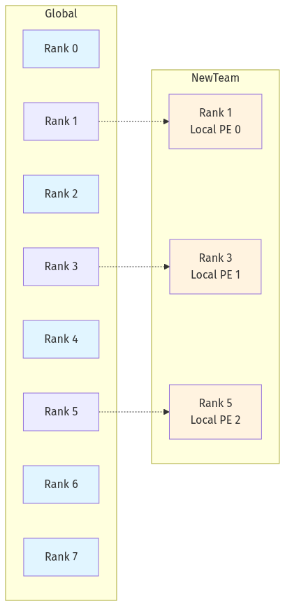

# SHMEM通信域（Team）介绍

Team是shmem的通信域概念，在相关接口中可以通过`team_id`访问，初始化后会有一个默认的全局通信域，其`team_id`是`ACLSHMEM_TEAM_WORLD = 0`。team的信息存储在在state的team_pools里，team_pools是一个aclshmemx_team_t的数组。aclshmemx_team_t内会存储当前team的id（team相关接口使用的索引）、当前进程在该team内的rank id、该team内的起始rank、rank间步长、rank数量等相关信息。

**aclshmemx_team_t内存储的mype和size是team内部的信息，aclshmem_device_host_state_t里存储的mype和npes是全局的信息。**
例如：对4个rank初始化shmem，前两卡和后两卡各为一个team。此时这四个rank的state里的mype分别是0,1,2,3。npes则都是4。但team_pools里的mype则分别是0，1，0，1。size为2。

## 子Team切分

shmem提供了专门的接口进行子Team的切分。

```c++
int aclshmem_team_split_strided(aclshmem_team_t parent_team, int pe_start, int pe_stride, int pe_size, aclshmem_team_t *new_team);
```

parent_team为父team，pe_start为起始pe，pe_stride为每次划分的步长，pe_size为划分的新team里pe的个数，new_team是出参是切分得到的新team的team_id。

以初始化好8个rank的场景为例，以如下方式调用切分接口。

```c++
aclshmem_team_t new_team;
// 从全局通信域中idx为1的pe开始，以步长为2，切分出3个pe后停止。
auto ret = aclshmem_team_split_strided(ACLSHMEM_TEAM_WORLD, 1, 2, 3, &amp;new_team);
```

此时new_team中有3个pe在state中的mype信息分别为1,3,5，他们的team_pools里的mype信息则分别为0,1,2。



## Team的使用

当算子只需要在部分rank运行时就会需要用到team相关接口,如`aclshmem_team_my_pe(my_team)`可以返回当前rank在my_team的mype信息，`aclshmem_my_pe()`可以返回当前rank在全局的mype信息。通常我们可以用team级别的mype信息作为算子内部资源数组的索引，使用全局的mype作为全局共享内存地址信息的索引。

同步接口也会使用到team_id，如shmem内部提供的team内的同步接口`aclshmem_barrier(aclshmem_team_t tid)`。
