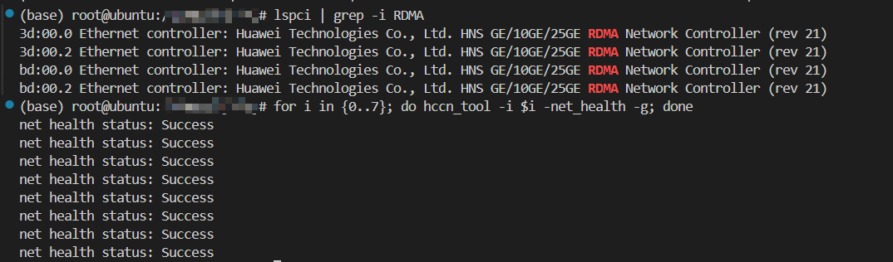
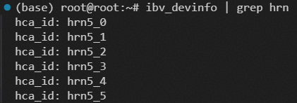

## 环境要求

- 运行本示例需要机器具备RDMA环境（RDMA网卡及驱动已正确安装配置）。

### 检查RDMA环境
#### Ascend910B/C平台
```bash
for i in {0..7}; do hccn_tool -i $i -ip -g; done
for i in {0..7}; do hccn_tool -i $i -net_health -g; done
```
注意：7需要根据实际要查看的卡数修改。

可用环境命令输出如下：  


#### Ascend950平台
使用`ibv_devinfo`命令检查RDMA设备信息。

云脉网卡：
```bash
ibv_devinfo | grep xscale
```


1825网卡：
```bash
ibv_devinfo | grep hrn
```


> 注：1825 网卡同端口通信时，若未开启交换机端口桥，RDMA 可能无法正常收发数据。端口桥配置详见[常见问题 - 端口桥配置](../../docs/debug/Troubleshooting_FAQs.md#同端口通信需开启端口桥)。

### IBV_EXTEND_DRIVERS 环境变量
Ascend950 平台运行前需设置 `IBV_EXTEND_DRIVERS` 环境变量，指向对应网卡的插件库：

- **云脉网卡（XSCALE）**：
  ```bash
  export IBV_EXTEND_DRIVERS=<path_to_libxscale_nda.so>
  ```
- **1825 网卡（HNS_1825）**：
  ```bash
  export IBV_EXTEND_DRIVERS=<path_to_libhrn5-rdmav34.so>
  ```
  > 注：\<path_to_libxscale_nda.so\>是libxscale_nda.so的路径，\<path_to_libhrn5-rdmav34.so\>是libhrn5-rdmav34.so的路径。

## 使用方式
### 编译
在shmem/目录执行以下命令进行编译（RDMA 后端完整参数说明见 [编译与构建 - RDMA 参数使用说明](../../docs/compilation_build_guide.md#rdma参数使用说明)）：
- Ascend910B/C 平台:
```bash
bash scripts/build.sh -enable_rdma -examples
```
- Ascend950 平台（云脉网卡 XSCALE）:
```bash
bash scripts/build.sh -soc_type Ascend950 -enable_rdma -rdma_backend XSCALE -examples
```
- Ascend950 平台（1825 网卡 HNS_1825）:
```bash
bash scripts/build.sh -soc_type Ascend950 -enable_rdma -rdma_backend HNS_1825 -examples
```
### 运行
#### 方式一：在`examples/rdma_demo`目录下执行`bash run.sh`

- 使用`run.sh`脚本执行

    `run.sh`支持通过`-pes`参数指定启动的PE数量，默认为2。
    ```bash
    bash run.sh -pes 4
    ```
    > 注：Ascend950 平台需设置 `IBV_EXTEND_DRIVERS` 环境变量，参见[环境变量说明](#ibv_extend_drivers-环境变量)。

#### 方式二：在shmem/目录手动运行命令
- 单机2卡执行命令
    ```bash
    export PROJECT_ROOT=<shmem-root-directory>
    export IBV_EXTEND_DRIVERS=<path_to_plugin.so>  # 仅Ascend950平台需要根据网卡类型进行环境变量设置，详见环境变量说明
    export LD_LIBRARY_PATH=${PROJECT_ROOT}/build/lib:$LD_LIBRARY_PATH
    ./build/bin/rdma_demo 2 0 tcp://127.0.0.1:8765 2 0 0 & # PE 0
    ./build/bin/rdma_demo 2 1 tcp://127.0.0.1:8765 2 0 0 & # PE 1
    ```
    > 注：\<shmem-root-directory\>为SHMEM项目的根目录。
- 跨机2卡执行命令

    假设机器A的ip为ip1，机器B的ip为ip2。
    在机器A执行如下命令：
    ```bash
    export PROJECT_ROOT=<shmem-root-directory>
    export IBV_EXTEND_DRIVERS=<path_to_plugin.so>  # 仅Ascend950平台需要根据网卡类型进行环境变量设置，详见环境变量说明
    export LD_LIBRARY_PATH=${PROJECT_ROOT}/build/lib:$LD_LIBRARY_PATH
    ./build/bin/rdma_demo 2 0 tcp://ip1:8765 1 0 0 # PE 0
    ```
    同时，在机器B执行如下命令：
    ```bash
    export PROJECT_ROOT=<shmem-root-directory>
    export IBV_EXTEND_DRIVERS=<path_to_plugin.so>  # 仅Ascend950平台需要根据网卡类型进行环境变量设置，详见环境变量说明
    export LD_LIBRARY_PATH=${PROJECT_ROOT}/build/lib:$LD_LIBRARY_PATH
    ./build/bin/rdma_demo 2 1 tcp://ip1:8765 1 1 0 # PE 1
    ```
    > 注：\<shmem-root-directory\>为SHMEM项目的根目录，\<path_to_plugin.so\>为根据网卡类型设置的插件库路径。
    >
    > 如需在容器中运行跨机测试，启动容器时指定`--net=host`模式即可。

3.命令行参数说明
```bash
    ./rdma_demo <n_pes> <pe_id> <ipport> <g_npus> <f_pe> <f_npu>
```
- n_pes: 全局PE数量。
- pe_id: 当前进程的PE号。
- ipport: SHMEM初始化需要的IP及端口号，格式为tcp://<IP>:<端口号>。如果执行跨机测试，需要将IP设为PE0所在Host的IP。
- g_npus: 当前机器上启动的NPU卡的数量。
- f_pe: 当前机器上使用的第一个PE号。
- f_npu: 当前机器执行本样例使用的第一张NPU卡的卡号
